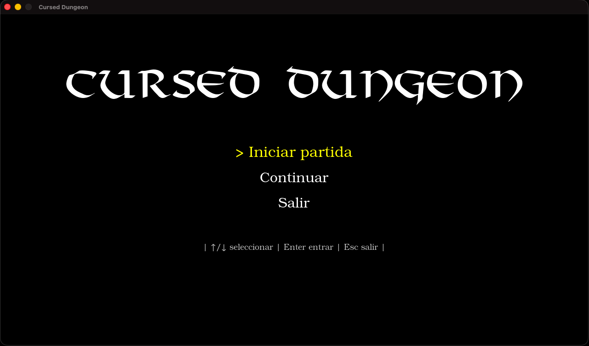
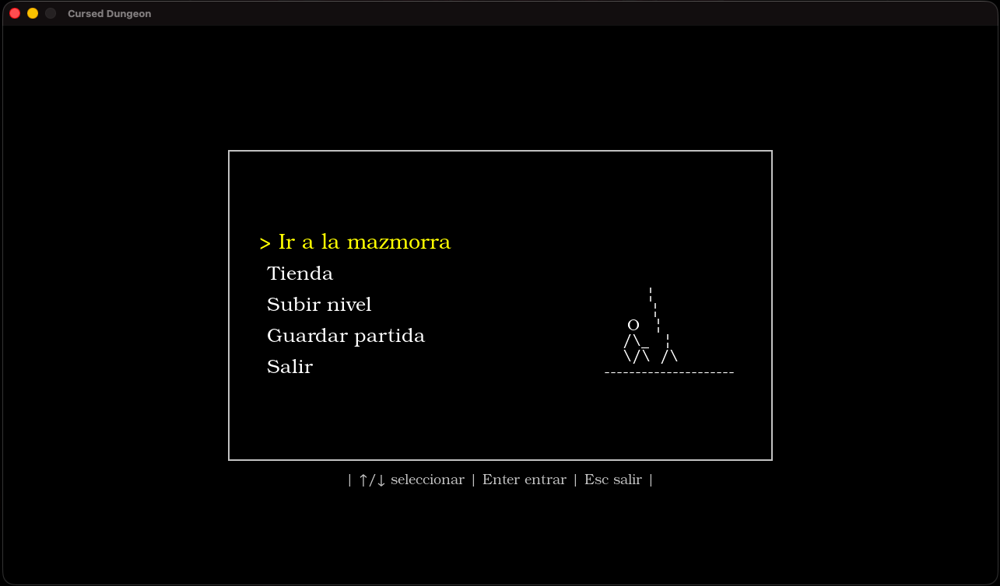
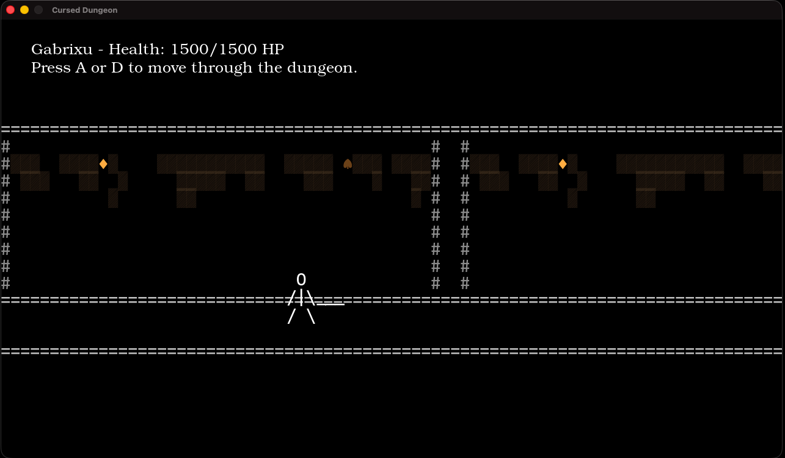

# Cursed Dungeon

Cursed Dungeon is a turn-based RPG set in a dark and cursed world. The player explores dangerous dungeons, fights increasingly powerful enemies, and grows stronger through a progression system built around combat, resource management, and strategic decision-making.

The long-term goal of the adventure is to reach the final confrontation against Ella, Goddess of Doom.

## Screenshots

<p align="center">
  
</p>

<p align="center">
  
</p>

<p align="center">
  
</p>

## Overview

Cursed Dungeon is a Python-based RPG project focused on building a solid gameplay foundation with a modular architecture. The project combines classic turn-based combat ideas with a structure designed to be maintainable, expandable, and easier to evolve over time.

The codebase is organized around separated gameplay systems such as combat, progression, shop logic, input handling, display management, and configuration, making it easier to iterate on new features without turning the project into a monolith.

## Current Status

The project is currently in active development and already includes a playable core experience.

At the moment, the game includes:
- A functional turn-based combat system
- Character progression and level-up logic
- Enemy scaling and status effects
- A shop system
- Centralized configuration and settings management
- A growing visual layer built with Pygame
- A modular project structure prepared for future expansion

The current focus is on improving the overall gameplay experience, polishing the visual presentation, and continuing to refine the internal architecture.

## Features

- Turn-based combat with attack flow, effects, and battle logic
- Character progression with scalable stats and leveling
- Enemies with increasing difficulty and combat variation
- Status effects that add strategic depth to encounters
- Shop mechanics to support progression
- Configuration and settings management
- Pygame-based rendering and interface systems
- Modular Python architecture for easier maintenance and extension

## Tech Stack

**Language**
- Python 3.9+

**Libraries**
- Pygame
- Asciimatics

**Standard Modules**
- json
- os
- time
- random
- math

## Project Structure

```plaintext
cursed-dungeon/
├── config.py
├── main.py
├── settings.json
├── levels/
│   ├── dungeon_combat.py
│   ├── game_menu.py
│   ├── level_up.py
│   ├── shop.py
│   └── start_game.py
├── src/
│   ├── display_manager.py
│   ├── input_manager.py
│   ├── others.py
│   ├── settings_manager.py
│   ├── animations/
│   │   ├── animations.py
│   │   ├── new_animations.py
│   │   └── walking.py
│   ├── assets/
│   │   └── fonts/
│   ├── db/
│   │   ├── enemyDb.json
│   │   └── weaponsDb.json
│   ├── object/
│   │   ├── main_character.py
│   │   ├── enemy.py
│   │   └── weapons.py
│   └── sounds/
└── README.md
```

## Getting Started

Clone the repository:

```bash
git clone https://github.com/GabrixuGames/cursed-dungeon.git
cd cursed-dungeon/cursed-dungeon
```

Create and activate a virtual environment:

```bash
python3 -m venv .venv
source .venv/bin/activate
```

Install dependencies:

```bash
pip install pygame asciimatics
```

Run the game:

```bash
python3 main.py
```

## Notes

This project is being built as both a game and a learning process around Python architecture, gameplay systems, modular design, and graphical integration with Pygame.

Some parts of the codebase are still evolving, but the current structure already reflects the intended direction of the project and provides a solid foundation for future development.

## Author

Developed by **GabrixuGames**.